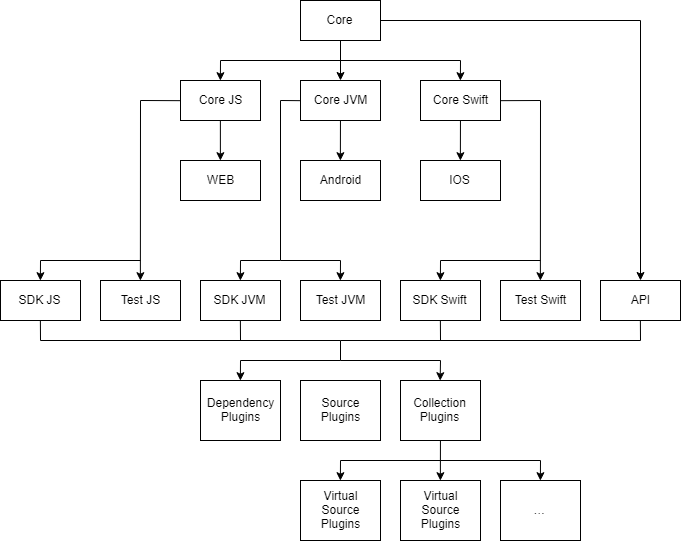

# EhViewer Evelin

EhViewer 2.0 Evelin 是一个支持插件的跨平台图片资源浏览器，其中漫画为主要对象。

本项目基于 [Kotlin](https://kotlinlang.org/) 的 [Multiplatform Projects](https://kotlinlang.org/docs/reference/multiplatform.html) 来实现跨平台。

Core 是 Multiplatform Projects 中的 common 模块。代码上完全用 Kotlin 来写。其主要目的是提供一套 API 接口供 Plugins 使用。同时也实现与平台无关的业务逻辑。

Core JS，Core JVM，Core Swift 是 Multiplatform Projects 中的 platform 模块。代码上要用 Kotlin 来写，也可使用其他语言，并且可以随意添加依赖。其主要目的是完善 Core 中未实现的业务逻辑。

Client 是 Multiplatform Projects 中的 regular 模块。代码上可以使用任意语言。其主要目的是提供用户界面，并将用户界面与业务逻辑相结合。

API 是 Plugins 使用的接口，由 Core 导出。每个平台的接口都是相同的。

SDK 是 Plugins 的编译环境，分别由 Core JS，Core JVM，Core Swift 导出。每个平台有不同的编译环境。

Test 是 Plugins 的测试环境。每个平台有不同的测试环境。其主要目的是方便开发者测试 Plugins。

Plugins 即插件。Plugins 应针对不同平台分别编译。若 Plugins 只使用了 Kotlin 与 API 接口的话，则在代码上是可以在不同平台上重用的。同时 Plugins 也可以使用与平台相关的代码，单独针对某个平台开发，以提供更好的功能。

Dependency Plugins 是用于提供其他 Plugins 运行环境的 Plugins。该种 Plugins 可能不需要由 Core 导出的 API，反而可由自身导出 API 供其他 Plugins 使用。其主要目的是减小应用与 Plugins 的大小，减少冗余，方便开发。

Source Plugins 是提供图片源的 Plugins。

Collection Plugins 为提供图片源的源的 Plugins，可理解为多个虚拟插件的集合。被管理的插件为 Virtual Source Plugins。每个 Collection Plugins 都提供了一个新的独立的插件系统，相当于一个 Collection Plugins 可充当多个 Source Plugins。值得注意的是 Collection Plugins 中的 Virtual Source Plugins 并没有特定的语言要求，所以可以使用脚本语言以解决跨平台问题。
